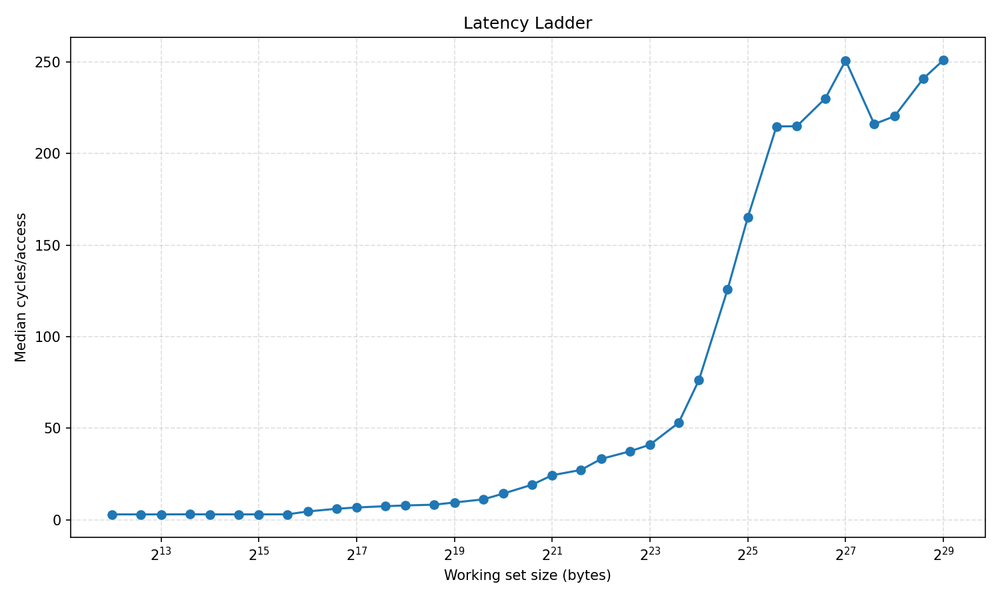
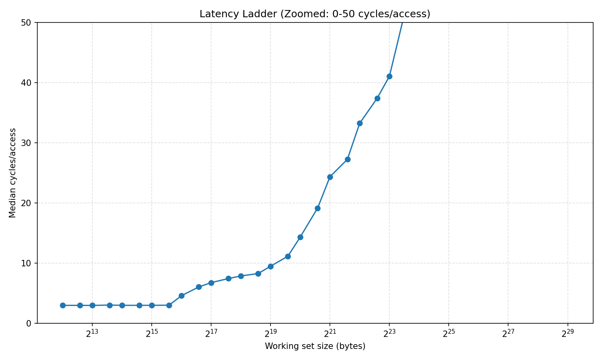
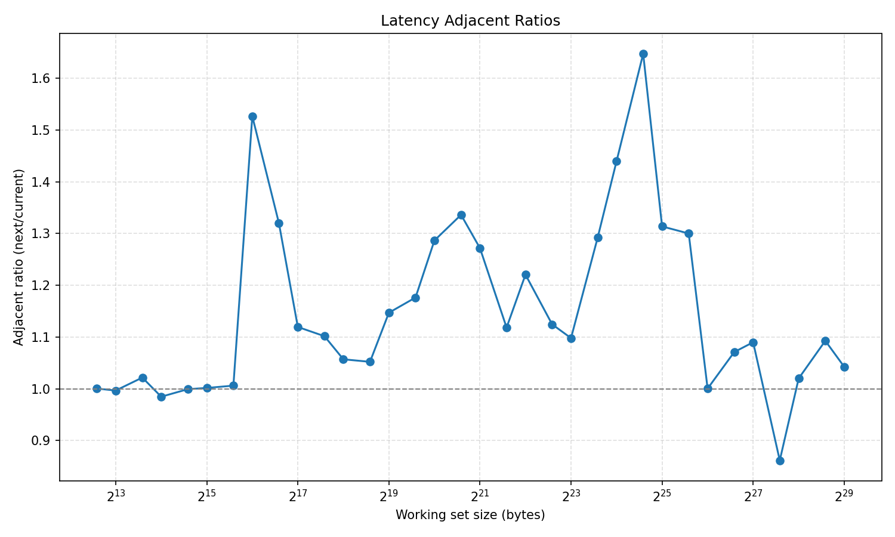

# Cache Analysis

Runtime pointer-chase experiment to infer cache hierarchy from latency data.

## Latest Result vs Hardware Spec

- L1
  - Inferred: 4.0 KiB to 64.0 KiB
  - Hardware: 48 KiB L1D per core
- L2
  - Inferred: 64.0 KiB to 1.5 MiB
  - Hardware: about 1.25 MiB L2 on the pinned core class
- LLC (L3)
  - Inferred: 1.5 MiB to 24.0 MiB
  - Hardware: 24 MiB shared L3
- DRAM
  - Inferred: 24.0 MiB to 512.0 MiB
  - Hardware expectation: accesses beyond LLC are DRAM-dominated

## Graphs

